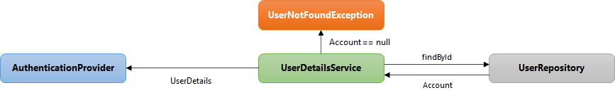
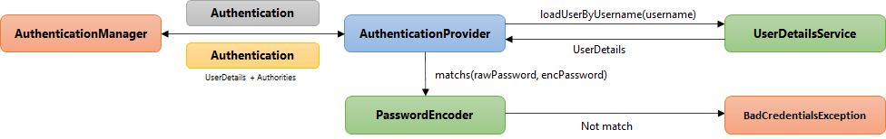
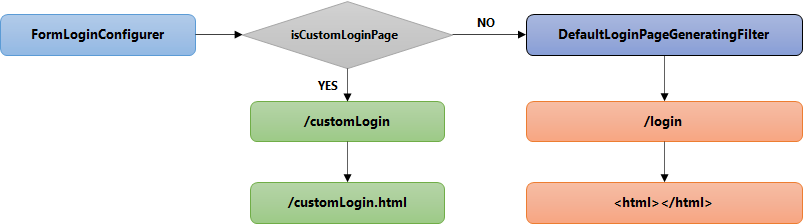
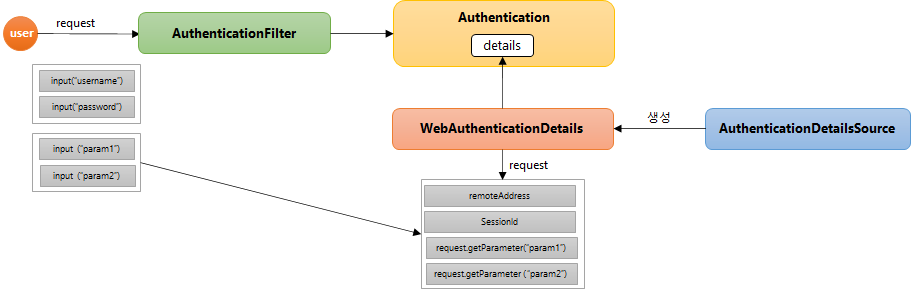
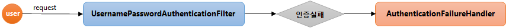
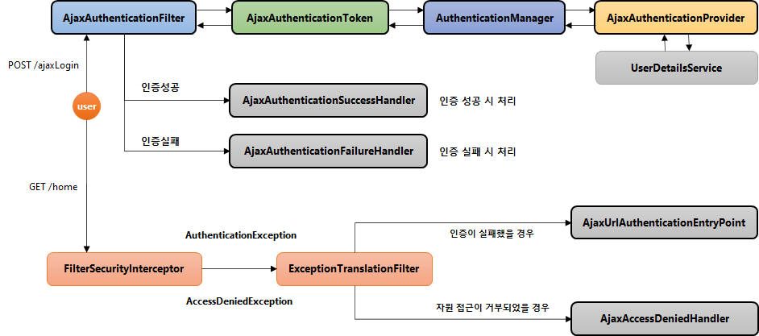

# Spring Security 실전 프로젝트

* 강의 : [스프링 시큐리티 - Spring Boot 기반으로 개발하는 Spring Security (정수원)](https://www.inflearn.com/course/%EC%BD%94%EC%96%B4-%EC%8A%A4%ED%94%84%EB%A7%81-%EC%8B%9C%ED%81%90%EB%A6%AC%ED%8B%B0/dashboard)
* 인프런 Spring- Security 강의를 들으면서 따라한 실전 프로젝트를 정리한 리포지토리 입니다.
* 프로젝트 진행하는 모든 소스 코드는 강사님의 [개인 github](https://github.com/onjsdnjs/corespringsecurity)에 올라가 있어 오픈소스로 판단하고 리포지토리에 정리 하였습니다. (강의 내용을 정리한 내용 및 실습 코드들은 private 리포지토리 형태로 저장하였음)

<br/>

## Ⅳ. 인증(Authentication) 프로세스 구현 

### # 01. 실전 프로젝트 구성

1. 프로젝트 명 : core-spring-security
2. 프로젝트 기본 구성
   * 의존성 설정, 환경 설정, UI 화면 구성, 기본 CRUD 기능
   * 스프링 시큐리티 보안 기능을 점진적으로 구현 및 완성
3. Springboot, Spring MVC, Spring Data JPA
4. 프로그램 설치
   * DB - Postgresql Serverop

<br/>

* Controller 파일들 생성
* Config 파일 생성
* html View 파일들 생성

<br/>

<br/>

### # 02. 메뉴 권한 및 WebIgnore 설정

> js / css / image 파일 등 보안 필터를 적용할 필요가 없는 리소스를 설정

```java
@Override
public void configure(WebSecurity web) throws Exception {
    web.ignoring().requestMatchers(PathRequest.toStaticResources().atCommonLocations());
}
```

<br/>

### # 04. Form 인증 – User 등록 / PasswordEncoder

* 비밀번호를 안전하게 암호화 하도록 제공
* Spring Security 5.0 이전에는 기본 PasswordEncoder 가 평문을 지원하는 NoOpPasswordEncoder

<br/>

#### 생성

```java
PasswordEncoder passwordEncoder = PasswordEncoderFactories.createDelegatingPasswordEncoder()
```

* 여러 개의 PasswordEncoder 유형을 선언한 뒤, 상황에 맞게 선택해서 사용할 수 있도록 지원하는 Encoder.

<br/>

#### 암호화 포맷 : {id}encodedPassword

* 알고리즘 종류 : bcrypt, noop, pbkdf2, scrypt, sha256
* 기본 포맷은 Bcrypt : {bcrypt}$2a$10$dXJ3SW6G7P50lGmMkkmwe.20cQQubK3.HZWzG3YB1tlRy.fqvM/BG

<br/>

#### 인터페이스

* encode(password)
  * 패스워드 암호화
* matches(rawPassword, encodedPassword)
  * 패스워드 비교

<br/>

<br/>

### # 05. Form 인증 – CustomUserDetailsService

> DB로부터 사용자를 직접 조회하고, 인증을 처리하도록!



```java
public UserDetails loadUserByUsername(String username) throws UsernameNotFoundException {
	Account account = userRepository.findByUsername(username);

    if (account == null) {
		throw new UsernameNotFoundException("No user found with username: " + username);	}
    
	// 권한
    ArrayList<GrantedAuthority> roles = new ArrayList<GrantedAuthority>();
    roles.add(new SimpleGrantedAuthority(account.getRole()));
	return new AccountContext(account, roles);
}
```

<br/>

<br/>

### # 06. Form 인증 – CustomAuthenticationProvider




```java
public Authentication authenticate(Authentication auth) throws AuthenticationException {
	String loginId = auth.getName();
    String passwd = (String) auth.getCredentials();
    
    UserDetails userDetails = uerDetailsService.loadUserByUsername(loginId);

    if (userDetails == null || !passwordEncoder.matches(passwd, userDetails.getPassword())) {
		throw new BadCredentialsException("Invalid password");
	}

    return new UsernamePasswordAuthenticationToken(userDetails.getUser(), null, userDetails.getAuthorities());
}
```

<br/>

<br/>

### # 07. Form 인증 – Custom Login Form Page

> 사용자 구현 Login Page

<br/>



```java
@Override
public void configure(HttpSecurity http) throws Exception {
    http.formLogin().loginPage("/customLogin")
}
```

<br/>

<br/>

### # 08. Form 인증 - 로그아웃 및 화면 보안 처리

* 로그아웃 방법
  * \<form> 태그를 사용해서 POST로 요청
  * \<a> 태크를 사용해서 GET 으로 요청 – SecurityContextLogoutHandler 활용

* 인증 여부에 따라 로그인/로그아웃 표현
  * \<li sec:authorize="isAnonymous()">\<a th:href="@{/login}">로그인\</a>\</li>
  * \<li sec:authorize="isAuthenticated()">\<a th:href="@{/logout}">로그아웃\</a>\</li>

```java
@GetMapping(value = "/logout")
public String logout(HttpServletRequest request, HttpServletResponse response) {
	Authentication auth = SecurityContextHolder.getContext().getAuthentication();
	if (auth != null) {
		new SecurityContextLogoutHandler().logout(request, response, auth);
	}
	return "redirect:/login";
}
```

<br/>

<br/>

### # 08. Form 인증 – WebAuthenticationDetails AuthenticationDetailsSource



* Authentication객체는 details라는 속성을 가지고 있다.
* 이 속성에 WebAuthenticationDetails라는 객체가 저장되어 있다.
* 이 객체는 request 라는 객체를 통해서 얻어온 추가적인 파라미터 값들을 저장하고 있다.

<br/>

#### WebAuthenticationDetails

> 사용자가 추가로 전달하는 파라미터들을 얻어서, 저장하는 역할

* 인증 과정 중 전달된 데이터를 저장
* Authentication의 details 속성에 저장

<br/>

#### AuthenticationDetailsSource

> WebAuthenticationDetails 객체를 생성

<br/>

<br/>

### # 09. Form 인증 – CustomAuthenticationSuccessHandler

> 인증에 성공 시 수행하는 SuccessHandler

<br/>

#### SecurityConfig

```java
@Override
public void configure(HttpSecurity http) throws Exception {
    http.formLogin().successHandler(CustomAuthenticationSuccessHandler())
}
```

<br/>

#### CustomAuthenticationSuccessHandler

```java
@Override
public void onAuthenticationSuccess(HttpServletRequest request, HttpServletResponse response, Authentication authentication) throws IOException {
	setDefaultTargetUrl("/");

	SavedRequest savedRequest = requestCache.getRequest(request, response);
    if (savedRequest != null) {
    	String targetUrl = savedRequest.getRedirectUrl();
        redirectStrategy.sendRedirect(request, response, targetUrl);
	} else {
    	redirectStrategy.sendRedirect(request, response, getDefaultTargetUrl());
	}     
}
```

<br/>

### # 10. Form 인증 – CustomAuthenticationFailureHandler

> 인증에 실패 시 수행하는 FailureHandler



<br/>

#### SecurityConfig

```java
@Override
public void configure(HttpSecurity http) throws Exception {
    http.formLogin().failureHandler(CustomAuthenticationFailureHandler())
}
```

<br/>

#### CustomAuthenticationSuccessHandler

```java
@Override
public void onAuthenticationFailure(HttpServletRequest request, HttpServletResponse response, AuthenticationException exception) throws IOException, ServletException {
    String errorMessage = "Invalid Username or Password";
    if (exception instanceof BadCredentialsException) {
    	errorMessage = "Invalid Username or Password";
    } else if (exception instanceof InsufficientAuthenticationException) {
    	errorMessage = "Invalid Secre	t Key";
	}
    setDefaultFailureUrl("/login?error=true&exception=" + errorMessage);
	super.onAuthenticationFailure(request, response, exception);
}
```

<br/>

<br/>

### # 11. Form 인증 - Access Denied

> 인가 예외 발생 시 처리하는 방법

* 인증 시도를 하다가 발생한 예외의 경우 인증을 처리하던 필터가 받아서 예외를 처리하는 것이고, 인가 예외의 경우에는 ExceptionTranslationFilter가 받아서 처리한다.
* 인증 이후 자원에 접근할 때 가장 큰 역할을 하는 ExceptionTranslationFilter에게 예외를 던져 처리하는데, 이 때 직접 구현한 AccessDeniedHandler를 호출해 예외 발생 시 기능을 수행하는 것이다.

<br/>

#### SecurityConfig

```java
@Override
public void configure(HttpSecurity http) throws Exception {
	http
    	.exceptionHandling()
        .accessDeniedHandler((accessDeniedHandler()));
}
```

<br/>

#### AccessDeniedHandler

```java
@Override
public void handle(HttpServletRequest request, HttpServletResponse response, AccessDeniedException accessDeniedException) throws IOException, ServletException {
	String deniedUrl = errorPage + "?exception=" + accessDeniedException.getMessage();
	response.sendRedirect(deniedUrl);
}

public void setErrorPage(String errorPage) {
	this.errorPage = errorPage;
}
```

<br/>

<br/>

### # 14. Ajax 인증 – 흐름 및 개요

> Ajax 인증 인가 처리에 대한 전체적인 Flow



* Spring Security의 인증, 인가처리는 모두 필터로 시작해 필터로 끝난다.
* 필터가 먼저 요청을 받아, 인증 객체 Token에 담아놓고 인증처리를 하게 된다.
  * 필터가 이 인증 객체를 Manager에게 전달해주고, 실질적인 인증처리를 담당하는 Provider에게 전달한다.
  * 앞서 본 Form 인증처리와 동일한 과정을 거친다.
  * 인증이 성공할 경우와 실패할 경우 Handler를 우리가 구현하는 것!!
* 위의 인증처리가 완료 되면, 이후에는 인가처리를 수행하게 된다.
* 만약 인증 및 인가에 대한 예외가 발생하면, ExceptionTranslationFilter가 이를 받아 처리한다.
  * 인증이 실패하면 AjaxUrlAuthenticationEntryPoint를, 자원 접근 거부시에는 AjaxAccessDeniendHandler를 구현해서 인가 처리를 수행한다.

<br/>

<br/>

### # 14. Ajax 인증 – AjaxAuthenticationFilter

> 사용자가 Ajax를 이용해 인증 처리를 할 때, 그것을 받아 인증 처리를 담당할 Ajax 전용 필터

* AbstractAuthenticationProcessingFilter 상속
  * UsernamePasswordAuthenticationFilter도 이걸 상속하고 있다.
  * 대부분의 인증처리 기능을 이 추상클래스가 하고 있다!
* 필터 작동 조건
  * AntPathRequestMatcher("/api/login") 로 요청정보와 매칭하고 요청 방식이 Ajax 이면 필터 작동
* AjaxAuthenticationToken 생성하여 AuthenticationManager 에게 전달하여 인증처리
  * 토큰도 직접 구현!
* Filter 추가
  * http.addFilterBefore(AjaxAuthenticationFilter(), UsernamePasswordAuthenticationFilter.class)

<br/>

<br/>

### # 15. Ajax 인증 – AjaxAuthenticationProvider

> 실질적으로 Ajax 인증을 처리하는 기능의 Provider를 구현한다.

* AuthenticationProvider 인터페이스 구현
* 인증 작동 조건
  * supports(Class<?> authentication)
    * ProviderManager로부터 넘어온 인증객체가 AjaxAuthenticationToken 타입이면 작동
* 인증 검증이 완료되면 AjaxAuthenticationToken 생성하여 최종 인증 객체 반환

<br/>

<br/>

### # 16. Ajax 인증 – AjaxAuthenticationSuccessHandler		   AjaxAuthenticationFailureHandler

> 인증 성공 시 수행하는 Handler

* AjaxAuthenticationSuccessHandler
  * AuthenticationSuccessHandler 인터페이스 구현
  * Response Header 설정
    * response.setStatus(HttpStatus.OK.value());
    * response.setContentType(MediaType.APPLICATION_JSON_VALUE);
  * JSON 형식으로 변환하여 인증 객체 리턴 함
    * objectMapper.writeValue(response.getWriter(), ResponseBody.ok(userDto));

<br/>

> 인증 실패 시 수행하는 Handler

* AjaxAuthenticationFailureHandler
  * AuthenticationFailureHandler 인터페이스 구현
  * Response Header 설정
    * response.setStatus(HttpStatus.UNAUTHORIZED.value());
    * response.setContentType(MediaType.APPLICATION_JSON_VALUE);
  * JSON 형식으로 변환하여 오류 메시지 리턴 함
    * objectMapper.writeValue(response.getWriter(), ResponseBody.error(message));

<br/>

<br/>

### # 17. Ajax 인증 – AjaxLoginUrlAuthenticationEntryPoint		   AjaxAccessDeniedHandler

> 인증되지 않은 사용자 접근 예외의 경우

* AjaxLoginUrlAuthenticationEntryPoint
  * ExceptionTranslationFilter 에서 인증 예외 시 호출
  * AuthenticationEntryPoint 인터페이스 구현
  * 인증 오류 메시와 401 상태 코드 반환
    * response.sendError(HttpServletResponse.SC_UNAUTHORIZED, "Unauthorized");

<br/>

> 인가되지 않은 사용자 접근 예외의 경우

* AjaxAccessDeniedHandler
  * ExceptionTranslationFilter 에서 인가 예외 시 호출
  * AccessDeniedHandler 인터페이스 구현
  * 인가 오류 메시지와 403 상태 코드 반환
    * response.sendError(HttpServletResponse. SC_FORBIDDEN, “forbidden");

<br/>

<br/>

### # 18. Ajax 인증 – DSL 로 Config  설정하기

> DSL : 도메인 특화 언어

* Custom DSLs
  * AbstractHttpConfigurer
    * 스프링 시큐리티 초기화 설정 클래스
    * 필터, 핸들러, 메서드, 속성 등을 한 곳에 정의하여 처리할 수 있는 편리함 제공
    * public void init(H http) throws Exception -  초기화
    * public void configure(H http) – 설정

* HttpSecurity 의 apply(C configurer) 메서드 사용

<br/>

<br/>

### # 19. Ajax 인증 - 로그인 Ajax 구현 & CSRF

* 헤더 설정
  * 전송 방식이 Ajax 인지의 여부를 위한 헤더설정
    * xhr.setRequestHeader("X-Requested-With", "XMLHttpRequest");
  * CSRF 헤더 설정
    * `<meta id="_csrf" name="_csrf" th:content="${_csrf.token}"/>`
    * `<meta id="_csrf_header" name="_csrf_header" th:content="${_csrf.headerName}"/>`
    * `var csrfHeader = $('meta[name="_csrf_header"]').attr('content')`
    * `var csrfToken = $('meta[name="_csrf"]').attr('content’)`
    * `xhr.setRequestHeader(csrfHeader, csrfToken);`

<br/>

<br/>

## Ⅴ. 인가(Authorization) 프로세스 구현 - DB 연동 

### # 01. 개요

* DB와 연동하여 자원 및 권한을 설정하고 제어함으로 동적 권한 관리가 가능하도록 한다
* 설정 클래스 소스에서 권한 관련 코드 모두 제거
  * ex) antMatcher(“/user”).hasRole(“USER＂)
* 관리자 시스템 구축 
  * 회원 관리 – 권한 부여
  * 권한 관리 – 권한 생성, 삭제
  * 자원 관리 – 자원 생성, 삭제, 수정, 권한 매핑
* 권한 계층 구현
  * URL – Url 요청 시 인가 처리
  * Method – 메소드 호출 시 인가 처리
    * Method
    * Pointcut

<br/>

<br/>

